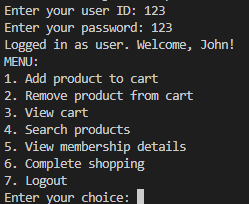
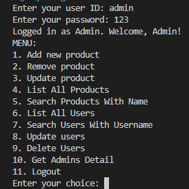

# DiscountGuru Shopping System Project
Welcome to the DiscountGuru Shopping System Project. This application, built with Java, simulates a simple online shopping system where users and administrators can perform various operations. Users can explore the product catalog, add items to their basket, and manage their basket items, while administrators have the ability to manage products and users. Data is stored in JSON files using Google's Gson library, providing persistence across multiple uses of the application.

## Features

>This project employs Object Oriented Programming (OOP) principles in Java to create a simple yet functional shopping system. OOP enables the encapsulation of related properties and behaviors into individual objects, thus making the code more modular, flexible, and understandable.

- **User Login:** Users can login with their predefined credentials.

- **Product Browsing and Management:** Users can view the product catalog, which includes details like the product name, category, and price. They can add desired products to their basket, view their basket's contents, and remove items from their basket as needed.
- **Admin Login and Management:** Admins have the ability to login with their predefined credentials. They can perform operations like adding, updating, and removing products and users. Furthermore, they can view a list of all users and their details.

## Structure
The DiscountGuru Shopping System consists of the following main files:
- `Person.java`: This class represents a person with attributes such as username, password, first name, last name, email, and phone number.
- `User.java`: Extending the Person class, this class represents a user in the system. It includes additional properties such as a basket to hold products, as well as methods for adding and removing items from the basket, calculating discount percentages based on user status, validating user credentials, checking if a user is a long-term customer, and writing or reading user data to or from a JSON file.
- `Admin.java`: Also an extension of the Person class, this class represents an admin in the system. In addition to the base class properties, it includes methods to add, remove, and update products and users, as well as reading or writing admin data to or from a JSON file.
- `Product.java`: The Product class in Java represents a product in an shopping system with attributes like id, name, category, and price. It provides methods for getting and setting these attributes, loading product data from a JSON file, checking if a product is eligible for discount, displaying product data, updating product details, buying a product, searching products, and writing product data back to a JSON file. This class plays a key role in managing the product-related operations in the system.
- `Main.java`: This is the driver class that includes the main method to run the application. It's responsible for creating the user interface, handling user interactions, and orchestrating the overall execution of the program.
- `products.json`: This JSON file stores a list of  products.
- `users.json`: This JSON file stores a list of users.
- `admins.json`: This JSON file stores a list of admins.

## Discount Rules
1.	If the user has gold card of the store, he gets a 30% discount
2.	If the user has silver card of the store, he gets a 20% discount
3.  If the user is an affiliate of the store, he gets a 10% discount
4.  If the user has been a customer for over 2 years, he gets a 5% discount.
5.  For every $200 on the bill, there would be a $ 5 discount (e.g. for $ 950, you get $ 20 as a discount).
6.  The percentage based discounts do not apply on phones.
7.  A user can get only one of the percentage based discounts on a bill.

## Documents
 **UML Diagram:**
 
Our system is composed of five main classes:

- Person: This class defines the common attributes of each individual within the system. Each Person has general information such as an ID and name, and can perform operations such as retrieving and setting these general information.

- User: The User class extends the Person class, inheriting the properties of Person and adding additional features. A User usually has a shopping cart.

- Admin: The Admin class also extends the Person class, inheriting the properties of Person. An Admin will have certain management capabilities.

- Product: The Product class represents a product within the system. Each Product has information such as an ID, name, category, and price, and has functions for returning and setting this information.

- Main: The Main class brings all these components together and provides an interface to the user. This usually involves a menu system and processes the user's selections.

Each class fulfills certain responsibilities using its fields and methods. Fields represent the state of a class, and methods define what a class can do.

## How to Run
1. Make sure Java Development Kit (JDK) is installed on your system. If not, download and install it from the official Oracle website.
2. This project uses the Gson library to parse and generate JSON. You need to download this library and add it to your project. You can find the Gson library on the official Gson GitHub repository. After downloading, you can add it to your project following the instructions specific to your IDE.
3. Compile and run the `Main.java` file to initiate the application. You will be prompted to log in as a user or an admin. Once logged in, you can navigate through the system and perform various operations according to your user type.

